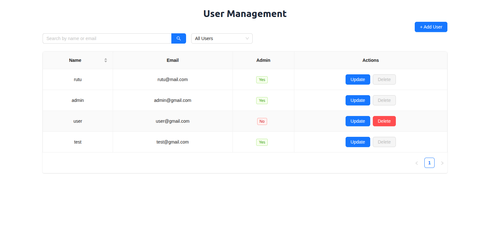

# Redux Toolkit – User Management App

A complete **CRUD User Management System** built with:

- Redux Toolkit + RTK Query
- Ant Design (UI components)
- Formik + Yup (form handling + validation)
- JSON Server (mock backend)
- Debounced search + role filters
- React-Toastify (notifications)

## Features

- Fetch users (`useGetUsersQuery`)
- Add / Update / Delete users with mutations
- Optimistic updates with `invalidatesTags`
- Search users by name/email (debounced)
- Filter users by role (Admin / Non-admin)
- Modal form with validation (Formik + Yup)

## Setup Instructions

### 1. Clone repo

<pre>
git clone https://github.com/Rutu-Koladiya/redux-toolkit.git
cd redux-toolkit/redux-test
</pre>

### 2. Install dependencies

`npm install`

### 3. Start JSON Server (Mock API)

`npx json-server --watch db.json --port 3000`

This will run a fake REST API at http://localhost:3000/user

### 4. Start React App

`npm run dev`

## Folder Structure

<pre>
redux-test/
│── src/
│   ├── app/store.js         # Redux store
│   ├── features/users/      # RTK Query userApi
│   ├── components/UserList  # User list, search, filters
│   ├── components/UserModal # Formik + Yup modal form
│   └── hook/useDebounce.js  # Debounced search hook
│   └── utils/validation.js  # validation schema
</pre>

### Tech Stack

<pre>
React
Redux Toolkit (RTK Query)
Ant Design
Formik + Yup
JSON Server
React Toastify
</pre>

